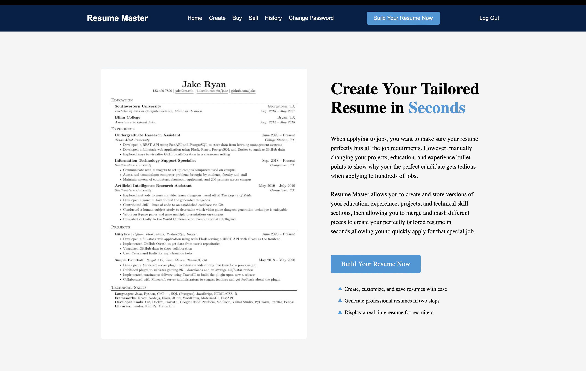
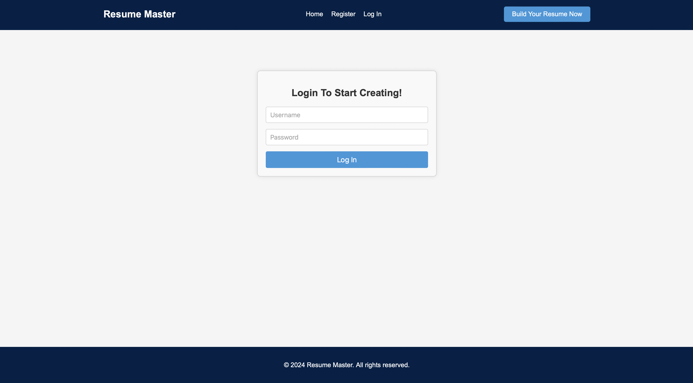
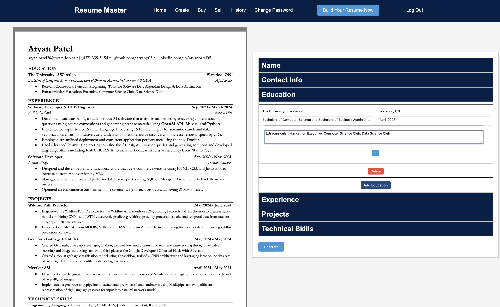

# 📄 Resume Master (WIP) 📄

**Want to create professional resumes effortlessly? 📝** <br>
<br>
**Need to tailor your resume for different job applications quickly? 💼** <br>
<br>
**Looking to save and merge resume components easily? 🔀** <br>
<br>
**Resume Master has got you covered! 🚀** <br>
<br>
Resume Master is your one-stop solution for creating, saving, merging, and tailoring resumes for job applications. With an intuitive web interface and powerful tools, you can manage your resume components with ease and create customized resumes in no time! Click here: https://resumemaster.azurewebsites.net



- **User Authentication**: Secure login and session management using Flask-Session and Werkzeug.
- **Resume Creation**: Easily create and format resumes using an intuitive web interface.
- **Component Management**: Save individual resume components, such as education, work experience, and skills, for easy reuse.
- **Resume Merging**: Combine multiple resume components to create customized resumes tailored to specific job applications.
- **Document Conversion**: Convert resumes from DOCX to PDF format with a single click.
- **PDF Generation**: Generate high-quality PDFs using ReportLab. <br> <br>



### User Registration and Authentication

Users can create a new account by registering with a unique username and password. Registered users can log in to access their personalized dashboard.

### Resume Creation and Formatting

Create and format resumes using the web interface. Add sections like education, work experience, skills, and more.

### Save and Manage Components

Save individual resume components for easy reuse. Manage your components from the dashboard.

### Merge Components

Combine multiple resume components to create a customized resume tailored to a specific job application.

### Convert DOCX to PDF

Convert your resumes from DOCX to PDF format with a single click, ensuring a professional and consistent presentation.

### Generate PDFs

Generate high-quality PDFs of your resumes using ReportLab. Customize the layout and formatting to suit your needs.



## Technologies Used

- Python
- Flask
- SQLite
- Bootstrap (for styling)
- python-docx
- docx2pdf
- ReportLab

## Installation

1. Clone the repository:
    ```sh
    git clone https://github.com/aryanp05/resumemaster.git
    cd resumemaster
    ```

2. Set up a virtual environment and install dependencies:
    ```sh
    python3 -m venv venv
    source venv/bin/activate
    pip install -r requirements.txt
    ```

3. Run the application:
    ```sh
    flask run
    ```

4. Open your browser and navigate to `http://127.0.0.1:5000`.

## Configuration

- **Session Configuration**: Configured to use the filesystem for session management.
- **Database**: SQLite database named `resume.db`.

### Routes

- `/`: Shows the user's dashboard with resume components and options.
- `/create`: Allows the user to create a new resume.
- `/save-component`: Allows the user to save a resume component.
- `/merge`: Allows the user to merge resume components.
- `/convert`: Converts a DOCX resume to PDF.
- `/login`: Logs the user in.
- `/logout`: Logs the user out.
- `/register`: Registers a new user.


## License

This project is licensed under the MIT License - see the [LICENSE](LICENSE) file for details.
